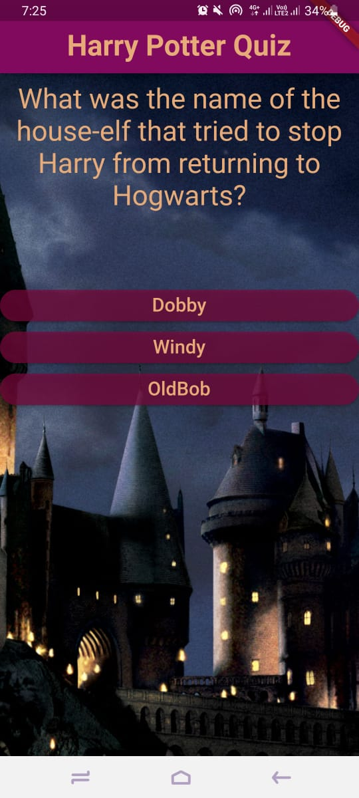

# HarryPotterQuizApp
A Harry Potter themed Quiz Mobile Application created in Flutter using Android Studio. 
The application currently constitutes of five questions but can be increased to any number of questions. 
File separtion and clean code has been taken under constideration while coding. 
The overlook of app lookslike this:  
#### Flutter App Screenshots

<table>
  <tr>
    <td>Question Screen Page</td>
     <td>Result with full Score</td>
     <td>Result with atleast 2 right Answers</td>
  </tr>
  <tr>
    <td></td>
    <td></td>
    <td></td>
  </tr>
 </table>
